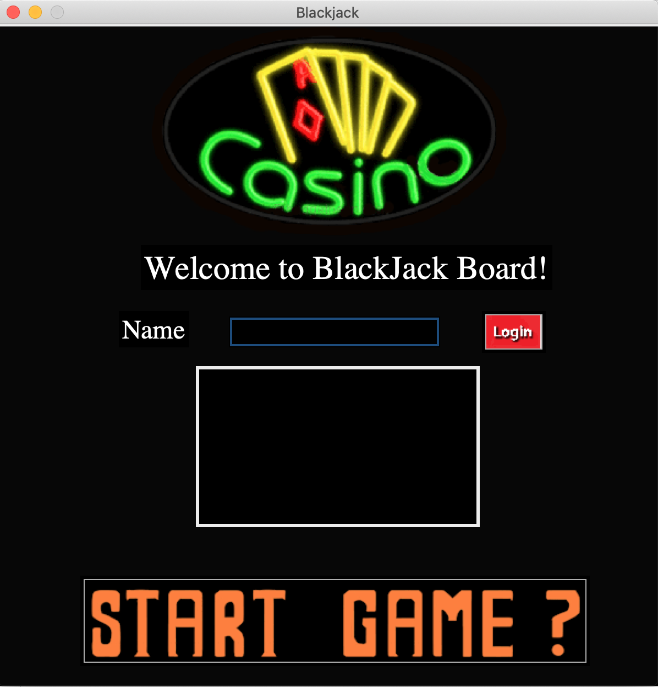
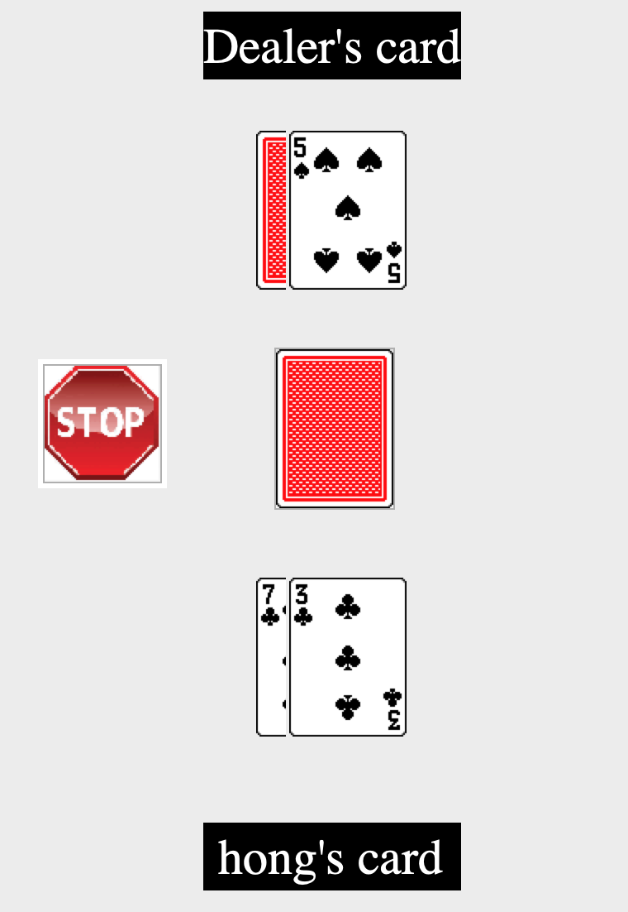
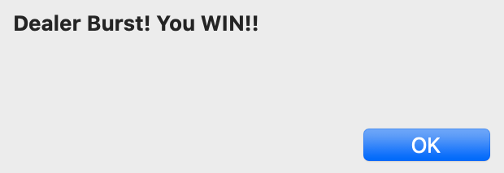
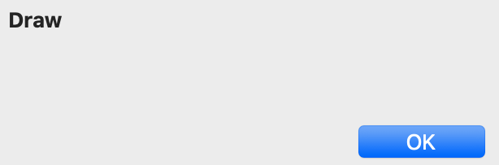
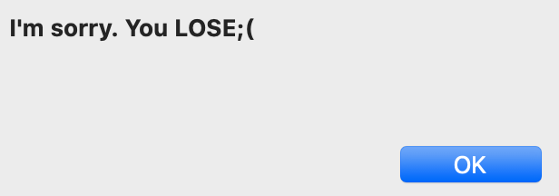
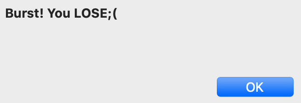
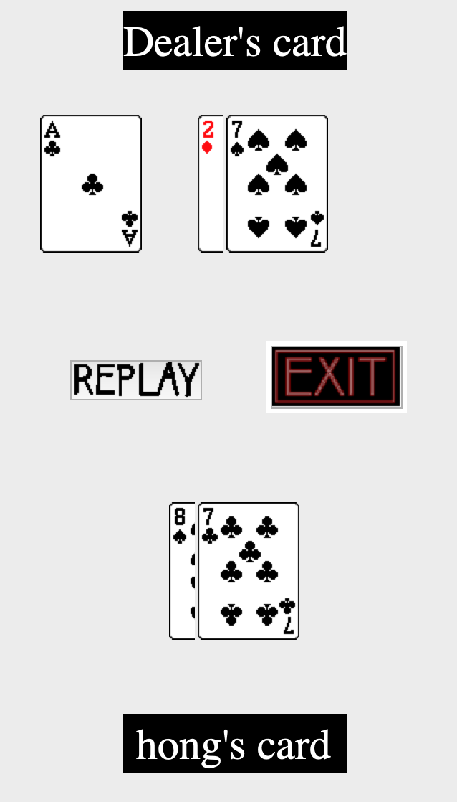

# Blackjack Game  
 

## 게임 룰
>카드를 딜러와 플레이어 각자 2장씩 나눠준다. 
>플레이어의 카드의 다 볼 수 있으며 딜러의 카드 한장은 볼 수 없다. 
>처음 받은 플레이어 2장의 카드의 합이 21 이면 블랙잭이다. 
>블랙잭이 아닐 경우 플레이어는 카드를 받고 싶을 때 까지 받을 수 있다. 
>플레이어가 카드를 받는 도중 카드의 합이 21이 넘는 경우 패배하게 된다. 
>플레이어의 카드 합이 21이 넘지 않고 플레이어가 카드 받기를 멈추면 딜러가 처음 받은 카드 2장의 합을 구한다.
>그 합이 21이면 플레이어는 블랙잭 패배를 해서 칩 2개를 잃는다. 합이 21이 고 17을 넘지 않는다면 합이 17이 넘기 전까지 딜러는 카드를 받는다. 
>합이 17이 넘고 21이 넘지 않으면 플레이어 카드의 합과 비교해서 승패를 결정한다. 
>하지만 딜러의 합이 21이 넘는다면 딜러가 버스트해서 플레이어가 승리하게 된다.  
>__더 자세한 설명__ 
> [블랙잭 게임 설명](https://namu.wiki/w/%EB%B8%94%EB%9E%99%EC%9E%AD%EC%B9%B4%EB%93%9C%EA%B2%8C%EC%9E%84)

## 실행 방법
1. __play.py 파일 실행__
2. __Player 이름 입력 후 Play 버튼 클릭__
> 새로운 Player가 등록되면 사용자 로컬에 members.txt 파일이 생성됨 
> 모든 플레이 기록이 해당 텍스트 파일에 저장됨

3. __Player는 가운데 뒤집힌 카드 이미지를 클릭하여 카드를 받을 수있으며 카드를 받고 싶지 않은 경우 stop 이미지를 클릭하여 게임을 종료할 수 있음__

4. __게임이 종료되면 Player는 게임 결과를 제공받음 __
</img>
</img>
</img>
</img>

5. __게임 종료 후 게임을 다시 시작하고 싶으면 Replay 이미지, 프로그램을 종료하고 싶으면 Exit 이미지를 클릭__

